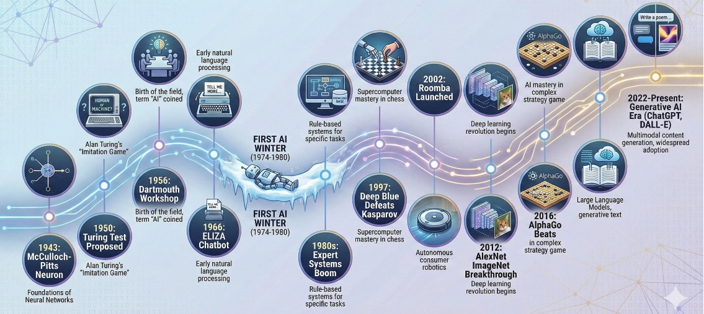
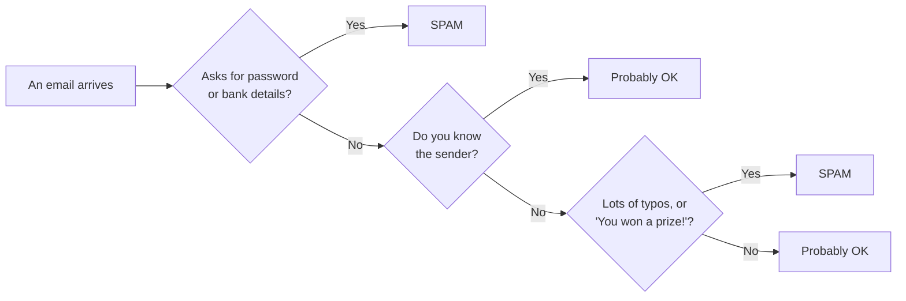
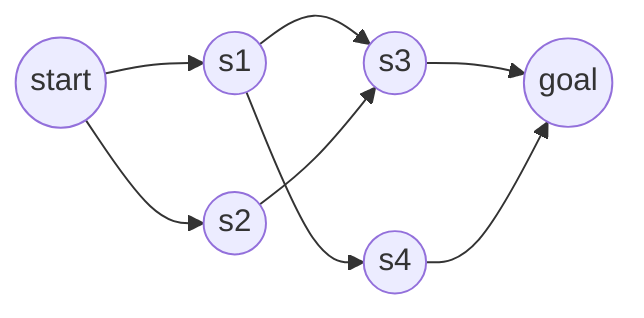

---
# You can also start simply with 'default'
theme: bricks
background: https://cover.sli.dev
title: Introduction to Artificial Intelligence
info: |
  ## Intro to AI — Bridge to Calculus
  Week 1
class: text-center
drawings:
  persist: false
transition: slide-left
mdc: true
---

# Introduction to Artificial Intelligence

Raj Venkat

---
layout: section
transition: fade-out
---
 

# Introductions

::right::

- **What is your name**
- **Why did you choose to take the AI module**
- **Ice breaker question** : What song or album could you listen to on repeat?

---

# Turns out, AI comes in a few flavors

<v-clicks>

- **Makes new things** : words, pictures, video, music
- **Guesses an answer** : like "is this email spam or not?"
- **Learns by trying** : gets better the more it practices
- **Finds a path** : like Maps finding a route to school

</v-clicks>

---

# Let's try some AI

**Makes things**

- Words : [ChatGPT](https://chat.openai.com/) , [Gemini](https://gemini.google.com/) , [Claude](https://claude.ai/)
- Pictures : [Gemini](https://gemini.google.com/)
- Video : [PixVerse](https://app.pixverse.ai/creation/video)
- Music : [Suno](https://suno.com/)
- Design : [Recraft](https://www.recraft.ai/get-started)

**Sees**

- [Google Lens](https://lens.google/)
- [Teachable Machine](https://teachablemachine.withgoogle.com/)

**Finds answers**

- [Andi](https://andisearch.com/)
- [Perplexity](https://www.perplexity.ai/)

 

**Try together** : put the **same prompt** in ChatGPT, Gemini, and Claude. How do they differ? 
\
Ask one in your **second language**. Does it still make sense?

---
layout: quote
---
# What is an "AI agent"?

An **agent** is a helper that **sees**, **thinks**, then **does** something.

---

# AI is all around you

What does each see? How do they act based on that?

**Roomba** \
sees: walls, dirt \
does: turn, clean

**Netflix** \
sees: what you watched \
does: pick what's next

**Google Maps** \
sees: roads, traffic \
does: choose a route

**ChatGPT** \
sees: your words \
does: guess the next words

**Autocomplete** \
sees: what you typed \
does: finish the word

**Your idea?** \
sees: ? \
does: ?

---

# Before you go

Please fill out the quick question form for next class's activity  [Tuesday Activity](#) 

---
layout: statement
class: text-center
---

# Thank you!

See you tomorrow.

---
layout: cover
---

# Introduction to Artificial Intelligence

Raj Venkat

---
layout: quote
---

# Recap

AI is all around us. An agent **sees**, **thinks**, then **does**. \
It can **make** things, **guess** answers, and **find** paths.

---
layout: section
transition: fade-out
---

# Where did AI come from?

---

# The story of AI

---
layout: section
---

# Turing Test: spot the bot

We send the **same question** to a person and to an AI.
Can you tell which answer is the human's?

[ChatGPT](https://chat.openai.com/) 
\
[Claude](https://claude.ai/)

::right::

    
  

---

# Why does AI need huge computers?

**CPU:** \
A **few** workers doing one job after another

**GPU:** \
**A lot of** workers doing jobs **all at once**

AI does a *huge* number of tiny sums at the same time. \
It can run in a giant **data center** or on a single **GPU** on a desk.

*Think: how much electricity does each one use?*

  <iframe width="100%" height="250" style="max-height:60vh; margin:auto;" class="rounded border mb-6" src="https://www.youtube.com/embed/gJ84mx3HbY8?si=Lp9TTbiZskrxdjpN" title="YouTube video player" frameborder="0" allow="accelerometer; autoplay; clipboard-write; encrypted-media; gyroscope; picture-in-picture; web-share" referrerpolicy="strict-origin-when-cross-origin" allowfullscreen loading="lazy"></iframe>

---
layout: statement
class: text-center
---

# Thank you!

See you tomorrow.

---
layout: intro
---

# Introduction to Artificial Intelligence

Raj Venkat

---
layout: quote
---

# Recap

AI grew up over ~70 years, in waves. \
It needs lots of computing and lots of **electricity**!!!

---
layout: section
transition: fade-out
---

# Every problem is secretly a game

---

# A game has three components

<v-clicks>

- A **state** is a picture of how things are *right now*
- A **move** is a way to change the state
- A **goal** is the state you're trying to reach

</v-clicks>

 
<v-click>

Solving the game = finding a **path** of moves to the goal.

</v-click>

---

# Is this email spam? (play 10 questions)

---

# Some games are about rules

**N-Queens** Place queens so none can attack another.

  <iframe width="800" height="800" style="display:block;" src="https://www.n-queens.com/" title="N-Queens puzzle"></iframe>

**Map coloring** 
\
Color regions so no two neighbors share a color.

[Open Map Coloring](https://mathigon.org/course/graph-theory/map-colouring){target="_blank" rel="noreferrer noopener"}

---

# Missionaries & cannibals

Get everyone across the river safely.

- A **state** = who is on each bank + where the boat is
- A **move** = one safe boat trip

[Play it online](https://plastelina.net/cannibals-missionaries/)

<iframe class="rounded border" width="100%" height="300" src="https://plastelina.net/cannibals-missionaries/" title="Missionaries and cannibals"></iframe>

---

# Connect the states → a map

Write states on paper, connect them with string. \
\
Solving = **finding a path** from start to goal.

---
layout: statement
class: text-center
---

# Thank you!

See you tomorrow.

---
layout: intro
---

# Introduction to Artificial Intelligence

Raj Venkat

---
layout: quote
---

# Recap

Every problem can be a **game**: states, moves, a goal. \
Connect the states and you get a **map** to search.

---
layout: section
transition: fade-out
---

# Finding the path = search

---

# Bigger maps

[**8-puzzle**](https://8puzzle.org/){target="_blank" rel="noreferrer noopener"}  
Slide tiles into order

[**Rubik's cube**](https://onlinecube.com/){target="_blank" rel="noreferrer noopener"}  
~43 quintillion states

[**Maze**](https://cariboutests.com/games/mazes.php?lang=en){target="_blank" rel="noreferrer noopener"}  
Start → Exit

 

The map is *huge*. Instead of guessing, find a smart way to reach the goal.

---

# Search = exploring step by step

An agent never sees the whole answer. It checks the closest states first, then the next ring, then the next — until it reaches the goal.

  <iframe 
    src="https://qiao.github.io/PathFinding.js/visual/" 
    width="100%" 
    height="800" 
    scrolling="yes" 
    style="border: none;">
  </iframe>

---
layout: statement
class: text-center
---

# What do **you** want to build?

---
layout: statement
---

# Thank you!

See you next week.
